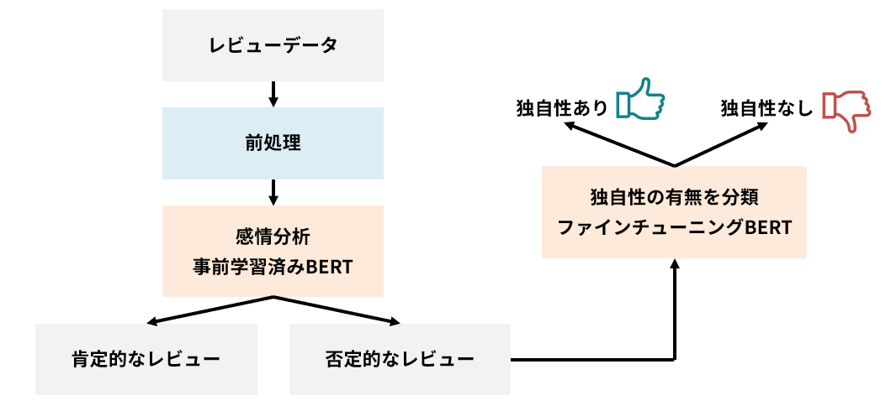
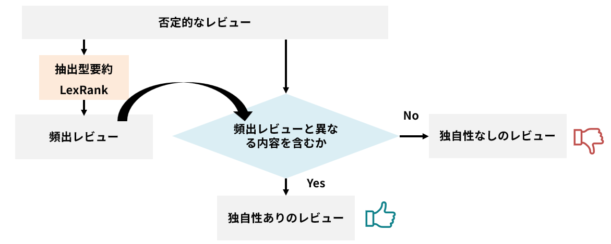
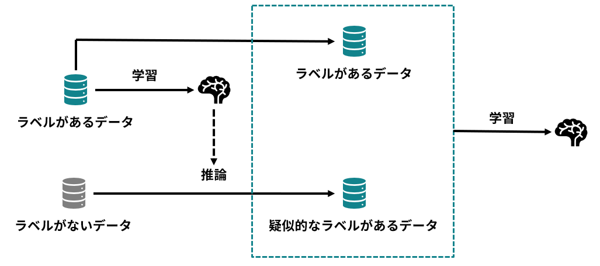

# Graduation_Research
卒業研究 : サービスデザインに有用なレビューを抽出するフレームワークの提案

## 全体像

1. 前処理
    - 1文ごとの分割
    - ノイズの除去

2. 否定的なレビューに限定する
    - [ファインチューニング済みのモデル](https://huggingface.co/jarvisx17/japanese-sentiment-analysis)を使用
    - 学習不要

3. BERTで独自性のある(=有用な)レビューを分類する
    - [事前学習済みモデル](https://huggingface.co/globis-university/deberta-v3-japanese-base)をファインチューニングする
    - ラベリングには、要約モデルを活用したラベリングと疑似ラベリングを使用



### ラベリング方法

- 要約モデルを活用したラベリング
    - 要約モデルで頻出の内容のレビューを抽出
    - 頻出レビューと異なる内容を含むかでラベリング
    
- 疑似ラベリング
    - 学習済みモデルの予測結果を疑似的なラベルとして、データを拡張する手法
    - 要約モデルによるラベリングではコストが高く、全レビューをラベリングできない
    - ノイズを含むデータを拡張しているため、拡張データの割合には注意が必要
    

## Usage

1. 依存関係の読み込み
```
poetry install
```

2. データの準備
```
# https://www.nii.ac.jp/dsc/idr/rakuten/ の楽天トラベルデータを申請し、/data/2024年度_楽天トラベルデータ/に配置する
# 1つのcsvにまとめる
mkdir -p output/rakuten
echo "UNZIP_PASSWORD=your unzip password" >> .env
cd src
poetry run python prepare_reviews.py
```
    
3. 1施設あたりのレビュー数が最多の施設レビューを抽出
```
poetry run python extract_facility_review.py
```

4. 前処理 + 否定的なレビューに限定 + 頻出レビューの抽出
```
poetry run python extract_common_review.py
```

5. 要約モデルを活用したラベリング

ラベル付きのレビューを`/output/rakuten/facility_19455/facility_reviews.csv`に保存

6. BERTでファインチューニング
```
poetry run python bert.py
```